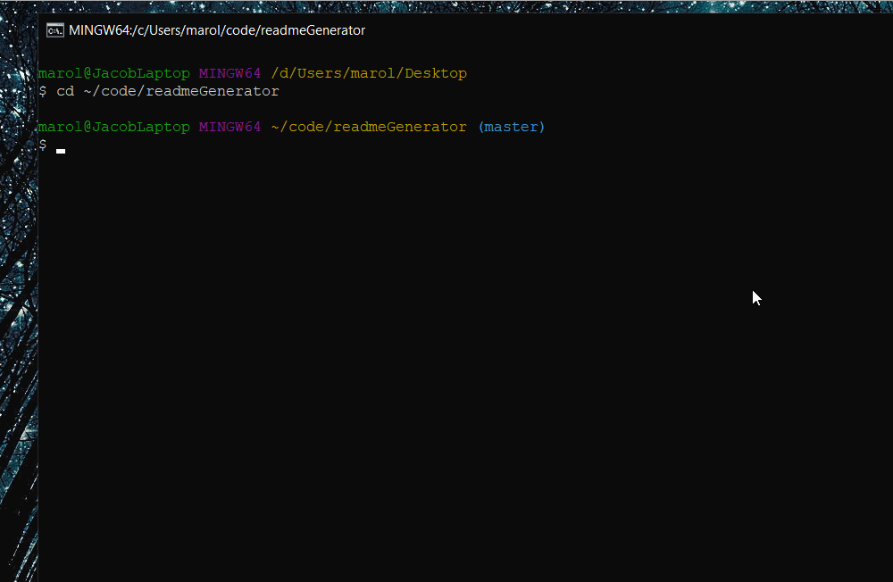

# Readme Generator


This CLI application allows the user to generate a professional README.md file for any github project by following a series of simple prompts related to the project. It dynamically generates sections of the readme based on the information given to make it a fit for any type of Full-Stack programming project. This README.md, as well as genREADME.md, are both generated using this generator.



## Table of Contents
1. [Installation Instructions](#installation-instructions)
2. [Usage](#usage)
3. [License](#license)
4. [Status](#status)
5. [Questions](#questions)


## Installation Instructions
npm install

## Usage
```
node index.js
```

## License
This application uses the MIT license. For more info, see the LICENSE document


## Status


## Questions
If you have any questions, you can ask Mrjcowman at Mrjcowman@gmail.com or through GitHub at [their profile](https://github.com/Mrjcowman)

